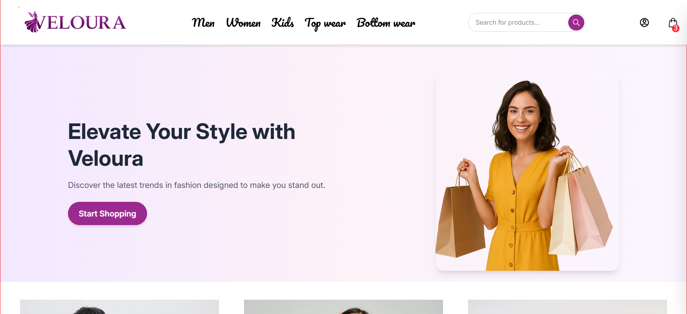
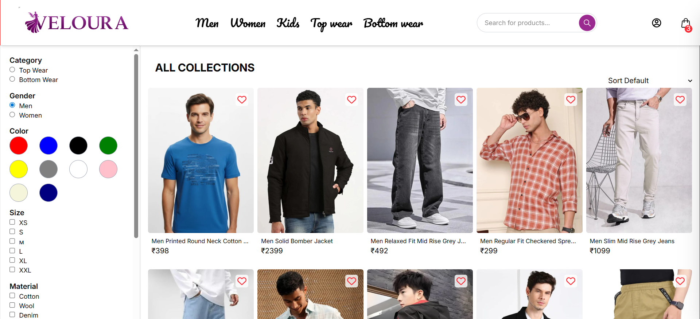
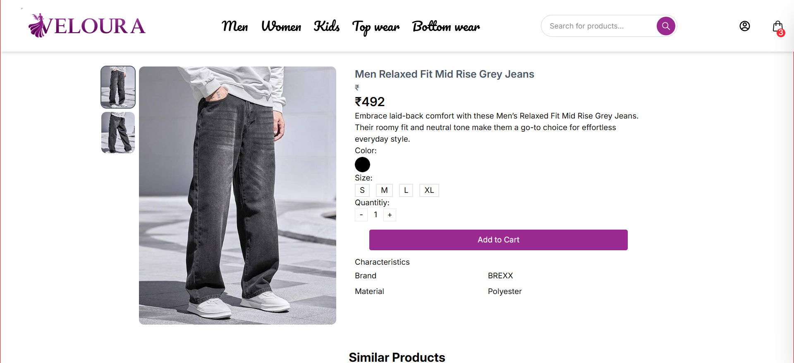
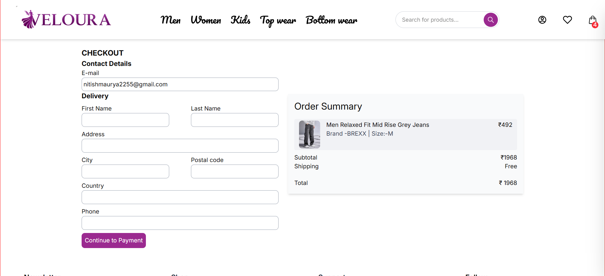

<h1 align="center">Veloura – MERN E-Commerce Platform</h1>

A scalable full-stack e-commerce application built with the MERN stack.

<h2>🚀 Project Overview</h2>

Veloura is a scalable full-stack e-commerce platform designed to provide secure authentication,
role-based access control, and seamless online payments. The application supports both
admin and user roles, enabling efficient product management and a smooth shopping experience.

<h2>🛠 Tech Stack</h2>

<h3>Frontend</h3>
<ul>
<li>React.js</li>
<li>Redux Toolkit</li>
<li>Tailwind CSS</li>
</ul>

<h3>Backend</h3>
<ul>
<li>Node.js</li>
<li>Express.js</li>
<li>REST APIs</li>
</ul>

<h3>Database</h3>
<ul>
<li>MongoDB</li>
</ul>

<h3>Authentication & Security</h3>
<ul>
<li>JWT Authentication</li>
<li>HTTP-Only Cookies</li>
<li>Google OAuth 2.0</li>
<li>bcrypt Password Hashing</li>
</ul>

<h3>Payments</h3>
<ul>
<li>Razorpay Payment Gateway</li>
</ul>

<h3>Deployment</h3>
<ul>
<li>Vercel</li>
</ul>

<h2>✨ Features</h2>

<ul>
<li>Secure login using JWT with HTTP-only cookies</li>
<li>Google OAuth 2.0 authentication</li>
<li>Role-based access control (Admin / User)</li>
<li>Admin dashboard with product CRUD operations</li>
<li>Order management system</li>
<li>Shopping cart functionality</li>
<li>Wishlist feature</li>
<li>Product review and rating system</li>
<li>Razorpay payment integration with backend signature verification</li>
<li>Responsive UI using Tailwind CSS</li>
<li>Skeleton loaders for better user experience</li>
<li>Optimized state management using Redux Toolkit</li>
</ul>

<h2>🔐 Security Practices</h2>

<ul>
<li>Password hashing using bcrypt</li>
<li>JWT stored in HTTP-only cookies</li>
<li>Middleware based request validation</li>
<li>Environment variables for sensitive data</li>
</ul>

<h2>📸 Screenshots</h2>

<h2>📈 Future Improvements</h2>

<ul>
<li>Advanced product filtering</li>
<li>Real-time order tracking</li>
<li>AI product recommendation system</li>
<li>Admin analytics dashboard</li>
</ul>

<h2>👨‍💻 Author</h2>

<b>Nitish</b>

B.Tech Computer Science

Full Stack MERN Developer

